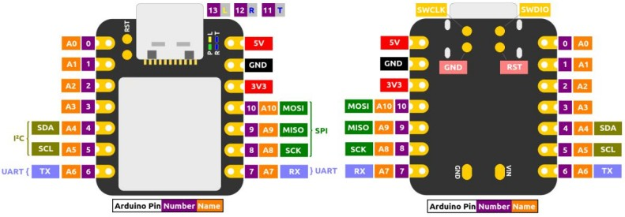

# xiao_m0_sketches

**Source code that accompanies the April 2022 version of [Overview of the SAMD21 Arm Cortex-M0+ Based Seeeduino XIAO](https://sigmdel.ca/michel/ha/xiao/seeeduino_xiao_01_en.html)**.

## Introduction

It should be possible to compile each project in the Arduino IDE or in PlatformIO. Each 
project should have no unresolved dependencies, meaning that all needed libraries are included. In other words, there should not be any need to install anything additional. Where a private library is included, only the necessary files were added. Please obtain the full library from the original source if it is to be used in another project.

## Obtaining the projects

It did not make sense to create a repository for each of these twenty projects so these are all lumped together. Download the `ZIP` archive or clone the repository to get a copy of all the projects at once.

To download a single project at a time try:

<pre>
~/temp$ <b>svn checkout https://github.com/sigmdel/xiao_m0_sketches/trunk/01_blink</b>
A    01_blink/.gitignore
A    01_blink/blink
A    01_blink/blink/blink.ino
A    01_blink/blink/main.cpp
A    01_blink/include
A    01_blink/include/README
A    01_blink/platformio.ini
</pre>

Apparently, it is more complicated but nevertheless possible to do the same with `git`, see [Quick tip: Clone a single folder from Github](https://dev.to/kiwicopple/quick-tip-clone-a-single-folder-from-github-44h6) by Paul Copplestone and [Checkout a single folder from a GitHub repository](https://coderwall.com/p/mglmxa/checkout-a-single-folder-from-a-github-repository) by Barnaby Alter.

## List of Projects      

| Project | Section in *Overview... XIAO* |
| ---     | ---                           |
| **01_blink** | [7. Only a Blink Sketch, But Do Read Me](https://sigmdel.ca/michel/ha/xiao/seeeduino_xiao_01_en.html#blink) |
| **02_startup** | [8. A Proper `setup()` Function](https://sigmdel.ca/michel/ha/xiao/seeeduino_xiao_01_en.html#setup ) |
| **03_blink2** | [8. A Proper `setup()` Function](https://sigmdel.ca/michel/ha/xiao/seeeduino_xiao_01_en.html#setup ) |
| **04_analog_In** | [10. Analogue Input and Output](https://sigmdel.ca/michel/ha/xiao/seeeduino_xiao_01_en.html#analog_io ) |
| **05_AnalogCorrection** | [10.1 Analogue Input Calibration](http://localhost/michel/ha/xiao/seeeduino_xiao_01_en.html#analog_calibration ) |
| **06_ldr_in** | [10.2 Analogue Measure of Light with an LDR](http://localhost/michel/ha/xiao/seeeduino_xiao_01_en.html#analog_in ) |
| **07_freetouch** | [10.3 Capacitance Touch Sensor](http://localhost/michel/ha/xiao/seeeduino_xiao_01_en.html#touch ) |
| **08_testtouch** | [10.3 Capacitance Touch Sensor](http://localhost/michel/ha/xiao/seeeduino_xiao_01_en.html#touch ) |
| **09_dac2adc** | [10.4 Analogue Output](http://localhost/michel/ha/xiao/seeeduino_xiao_01_en.html#analog_out ) |
| **10_digitalOut** | [11.1 Digital Output](http://localhost/michel/ha/xiao/seeeduino_xiao_01_en.html#digital_output ) |
| **11_pwm** | [11.2 Pulse Width Modulation](http://localhost/michel/ha/xiao/seeeduino_xiao_01_en.html#xiao_pwm ) |
| **12_digitalIn** | [11.3 Digital Input](http://localhost/michel/ha/xiao/seeeduino_xiao_01_en.html#digital_input ) |
| **13_dac2digIn** | [11.3 Digital Input](http://localhost/michel/ha/xiao/seeeduino_xiao_01_en.html#digital_input ) |
| **14_interrupts** | [12. Interrupts](http://localhost/michel/ha/xiao/seeeduino_xiao_01_en.html#interrupts ) |
| **15_timers** | [13. Timers](http://localhost/michel/ha/xiao/seeeduino_xiao_01_en.html#timers ) |
| **16_basicwdt** | [14. Watchdog](http://localhost/michel/ha/xiao/seeeduino_xiao_01_en.html#wdt ) |
| **17_uart** | [15.1 UART](http://localhost/michel/ha/xiao/seeeduino_xiao_01_en.html#uart ) |
| **18_spi_test** | [15.2 SPI](http://localhost/michel/ha/xiao/seeeduino_xiao_01_en.html#spi ) |
| **19_i2c_scan** | [15.3 I²C](http://localhost/michel/ha/xiao/seeeduino_xiao_01_en.html#i2c ) |
| **20_i2c_clock** | [15.3 I²C](http://localhost/michel/ha/xiao/seeeduino_xiao_01_en.html#i2c ) |

## License

Copyright 2022, Michel Deslierres. No rights reserved. 

While the copyright pertaining to included libraries must be respected, all the code by Michel Deslierres in this repository is in the public domain. In those jurisdictions where this may be a problem, the [BSD Zero Clause License](https://spdx.org/licenses/0BSD.html) applies.
